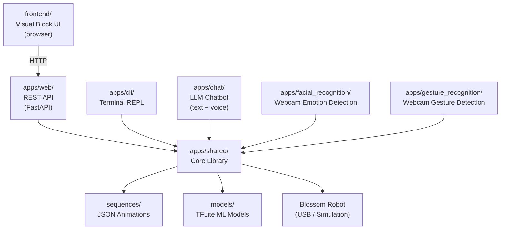

# HRIBlossom

HRIBlossom is a research platform for controlling **Blossom** — a soft, expressive robot designed for Human-Robot Interaction (HRI) research. Blossom has five motors (called *degrees of freedom*): three tower joints, a rotating base, and movable ears. You can bring Blossom to life through a visual drag-and-drop interface, a terminal, a chatbot, or your own webcam.

> **No robot? No problem.** Every application automatically falls back to **simulation mode** when Blossom is not physically connected. You can develop, test, and explore all features without any hardware.

---

## Table of Contents

1. [How It Works](#how-it-works)
2. [Prerequisites](#prerequisites)
3. [Forking and Getting the Project Files](#forking-and-getting-the-project-files)
4. [Python Environment Setup](#python-environment-setup)
5. [Hardware Setup (Optional)](#hardware-setup-optional)
6. [OpenAI API Key (Chat Only)](#openai-api-key-chat-only)
7. [Running the Applications](#running-the-applications)
   - [Visual Frontend + Web API](#1-visual-frontend--web-api-recommended-starting-point)
   - [Terminal CLI](#2-terminal-cli)
   - [Text Chatbot](#3-text-chatbot)
   - [Voice Chatbot](#4-voice-chatbot)
   - [Facial Emotion Recognition](#5-facial-emotion-recognition)
   - [Hand Gesture Recognition](#6-hand-gesture-recognition)
   - [Reset Position Editor](#7-reset-position-editor)
8. [Project Structure](#project-structure)
9. [Troubleshooting](#troubleshooting)

---

## How It Works

HRIBlossom is a **monorepo** — a single folder containing several independent sub-projects that all work together to drive the same robot.



| Sub-project | What it does |
|---|---|
| `apps/web` | FastAPI server that exposes a REST API for robot control |
| `apps/cli` | Simple terminal interface to list and play animations |
| `apps/chat` | GPT-4o-mini chatbot that makes Blossom react emotionally (text or voice) |
| `apps/facial_recognition` | Webcam pipeline: detects your facial expression → plays a matching animation |
| `apps/gesture_recognition` | Webcam pipeline: detects your hand gesture → plays a matching animation |
| `apps/shared` | Core library shared by all Python apps (robot driver, sequence loader, ML classifier) |
| `frontend` | Browser-based drag-and-drop block editor for creating new animations |

---

## Prerequisites

You will need three tools installed before running HRIBlossom. Follow the steps below in order.

### 1. Python 3.12

1. Go to [https://www.python.org/downloads/](https://www.python.org/downloads/)
2. Click **Download Python 3.12.x** (the yellow button)
3. Run the installer
4. **Important:** On the first screen, tick the checkbox **"Add python.exe to PATH"** before clicking Install Now
5. Once installed, open **PowerShell** (press `Win + R`, type `powershell`, press Enter) and verify:
   ```powershell
   python --version
   ```
   You should see something like `Python 3.12.x`.

### 2. uv (Python package manager)

`uv` is a fast tool that manages Python dependencies for this project. Install it by running this single command in PowerShell:

```powershell
powershell -ExecutionPolicy ByPass -c "irm https://astral.sh/uv/install.ps1 | iex"
```

Close and reopen PowerShell after it finishes, then verify:

```powershell
uv --version
```

### 3. Node.js (for the Visual Frontend only)

You only need this if you plan to use the browser-based visual interface.

1. Go to [https://nodejs.org/](https://nodejs.org/)
2. Click the **LTS** download button
3. Run the installer with all default settings
4. Verify in PowerShell:
   ```powershell
   node --version
   npm --version
   ```

### 4. Git (for forking and cloning the repository)

Git is a version control tool that lets you download the project and track any changes you make to it.

1. Go to [https://git-scm.com/download/win](https://git-scm.com/download/win)
2. The download should start automatically — run the installer
3. Accept all default settings on every screen and click **Next** through to the end
4. Verify in a **new** PowerShell window:
   ```powershell
   git --version
   ```

---

## Forking and Getting the Project Files

### What is a fork?

A **fork** is your own personal copy of this project on GitHub. Forking lets you freely make changes, add features, or experiment without affecting the original project. It is the recommended way to work with HRIBlossom if you intend to customise anything.

> You will need a free GitHub account to fork. Sign up at [https://github.com](https://github.com) if you don't have one.

### Step 1 — Fork the repository on GitHub

1. Open the HRIBlossom repository page on GitHub in your browser
2. Click the **Fork** button near the top-right of the page
3. On the next screen, leave all settings as-is and click **Create fork**
4. GitHub will create a copy of the project under your own account (e.g. `https://github.com/your-username/HRIBlossom`)

### Step 2 — Clone your fork to your computer

"Cloning" downloads your forked copy to your machine so you can run and edit it.

1. On your forked repository page, click the green **Code** button
2. Make sure **HTTPS** is selected, then click the copy icon to copy the URL (it looks like `https://github.com/your-username/HRIBlossom.git`)
3. Open PowerShell, navigate to where you want the project folder to live, then run:
   ```powershell
   cd C:\Research
   git clone https://github.com/your-username/HRIBlossom.git
   ```
   Replace the URL with the one you copied. This creates an `HRIBlossom` folder at `C:\Research\HRIBlossom`.

4. Navigate into the project:
   ```powershell
   cd HRIBlossom
   ```

### Saving your changes

After editing any files, you can save a snapshot of your work with:

```powershell
git add .
git commit -m "Describe what you changed here"
git push
```

This uploads your changes back to your fork on GitHub so they are backed up and shareable.

---

### Already have the folder on your machine?

If the project folder already exists on your disk (e.g. it was shared as a ZIP), simply open PowerShell and navigate to it:

```powershell
cd "C:\Research\HRIBlossom"
```

> All commands in this README must be run from the **project root** (`HRIBlossom/`) unless stated otherwise.

---

## Python Environment Setup

Run this command once from the project root to install all Python dependencies:

```powershell
uv sync
```

This creates a self-contained virtual environment (`.venv/`) inside the project folder and installs every library the project needs (FastAPI, LangChain, OpenCV, MediaPipe, pypot, TensorFlow, etc.) exactly as specified in `uv.lock`. Nothing is installed globally on your machine.

After this completes, you are ready to run any of the Python applications.

---

## Hardware Setup (Optional)

If you have a physical Blossom robot:

1. Connect Blossom to your computer via USB
2. On Windows, it will appear as serial port **COM3** in Device Manager
3. That's all — the software will detect it automatically on startup

If Blossom is **not** connected, every application prints a notice and continues in simulation mode. All sequences, the chatbot, and the frontend work identically in simulation — motor commands are simply logged instead of sent to hardware.

---

## OpenAI API Key (Chat Only)

The chatbot (`apps/chat`) uses OpenAI's GPT-4o-mini model. You need an API key to use it. This is **not required** for any other part of the project.

1. Sign up or log in at [https://platform.openai.com/](https://platform.openai.com/)
2. Navigate to **API Keys** and create a new key
3. In the project root, open the file named `.env` (create it if it doesn't exist) and add:
   ```
   OPENAI_API_KEY=sk-proj-your-key-here
   ```

> Keep this file private. It contains a secret credential.

---

## Running the Applications

Open a PowerShell window and navigate to the project root before running any command.

---

### 1. Visual Frontend + Web API (Recommended Starting Point)

This is the main graphical interface. It requires **two** terminal windows running at the same time.

**Terminal 1 — Start the backend API:**

```powershell
uv run uvicorn apps.web.main:app --reload --port 8000
```

Leave this running. You should see `Application startup complete.`

**Terminal 2 — Start the frontend (first time only, install dependencies):**

```powershell
cd frontend
npm install
npm start
```

Then open your browser and go to **[http://localhost:8080](http://localhost:8080)**.

**What you can do in the browser:**

- Drag and drop blocks to build a robot animation sequence
- Each **Frame** block represents a moment in time (in milliseconds)
- Each **Set all positions** block sets the five motor values (1–5) for that moment
- Click **Play Sequence** to send the animation to the robot
- Click **Reset Robot** to return Blossom to its default position
- Browse and replay previously saved sequences

**Example sequence layout in the block editor:**

```
Create sequence named "wave"
  ├─ Frame at 0 ms
  │   └─ Set all positions (tower_1: 3, tower_2: 3, tower_3: 3, base: 3, ears: 5)
  └─ Frame at 1000 ms
      └─ Set all positions (tower_1: 5, tower_2: 5, tower_3: 3, base: 3, ears: 5)
```

---

### 2. Terminal CLI

A simple keyboard-driven interface for playing animations directly from the terminal.

```powershell
uv run python -m apps.cli.main
```

| Key | Action |
|---|---|
| `l` | List all available animation sequences |
| `s` | Play a random sequence |
| `q` | Quit |
| *(any name)* | Type a sequence name and press Enter to play it |

---

### 3. Text Chatbot

Talk to Blossom as a conversational AI. Blossom responds with empathetic text and automatically chooses physical animations to match the emotional tone.

**Requires:** `.env` file with a valid `OPENAI_API_KEY` (see [OpenAI API Key](#openai-api-key-chat-only))

```powershell
uv run python -m apps.chat.text
```

Type your message and press Enter. Blossom will reply and, when appropriate, play a matching animation on the robot.

---

### 4. Voice Chatbot

The same chatbot as above, but with speech input and spoken responses.

**Requires:** `.env` file with a valid `OPENAI_API_KEY`, plus a working **microphone**.

```powershell
uv run python -m apps.chat.voice
```

- **Hold the Space bar** to record your voice
- **Release Space** to send the recording
- Your speech is transcribed by OpenAI Whisper, processed by GPT-4o-mini, and the response is spoken aloud via OpenAI TTS

---

### 5. Facial Emotion Recognition

Watches your face through a webcam and triggers robot animations based on the emotion it detects.

**Requires:** A working **webcam**.

```powershell
uv run python -m apps.facial_recognition.main
```

The app opens a webcam window showing your face with landmark overlays. When it detects an emotion with high confidence (> 70%), Blossom plays the corresponding animation. Press `q` in the webcam window to quit.

**Recognized emotions and their animations:**

| Detected emotion | Animation played |
|---|---|
| Happy | `happy_1` or `happy_10` |
| Sad | `sad_1` |
| Neutral / rest | `reset` |

---

### 6. Hand Gesture Recognition

Watches your hands through a webcam and triggers robot animations based on your gesture.

**Requires:** A working **webcam**.

```powershell
uv run python -m apps.gesture_recognition.main
```

Hold your hand up to the camera. When a gesture is recognized, Blossom plays the matching animation. Press `q` in the webcam window to quit.

**Recognized gestures and their animations:**

| Gesture | Animation played |
|---|---|
| Thumbs up | `happy_sequence` |
| Peace sign (V) | `yes_sequence` |
| Closed fist | `anger_sequence` |
| Open palm | `happy_sequence` |

---

### 7. Reset Position Editor

An interactive terminal tool for configuring the robot's default resting position. Use this if Blossom's rest pose needs adjusting after assembly.

```powershell
uv run python reset.py
```

Use the **arrow keys** to select a motor and adjust its position (scale 0–10). The change can be previewed live on the real robot if connected. Press `s` to save the new reset position to `sequences/reset_sequence.json`.

---

## Project Structure

```
HRIBlossom/
│
├── apps/                          # All Python sub-applications
│   ├── shared/                    # Core library used by all apps
│   │   ├── models/
│   │   │   ├── robot.py           # BlossomRobot — motor control abstraction
│   │   │   ├── robot_config.py    # Hardware config (COM3, motor IDs)
│   │   │   ├── sequence.py        # Loads and plays JSON animation files
│   │   │   └── frame.py           # Single animation frame data model
│   │   ├── keypoint_classifier/
│   │   │   └── classifier.py      # TFLite inference (emotion / gesture)
│   │   └── utils/
│   │       └── sequence.py        # Helpers: list sequences, get by name
│   │
│   ├── web/                       # FastAPI REST API server
│   │   └── main.py                # All API endpoints
│   │
│   ├── cli/                       # Terminal REPL
│   │   └── main.py
│   │
│   ├── chat/                      # LLM chatbot (text + voice)
│   │   ├── text.py                # Text interface entry point
│   │   ├── voice.py               # Voice interface entry point
│   │   └── chatbot/
│   │       └── agent.py           # LangGraph agent (GPT-4o-mini)
│   │
│   ├── facial_recognition/        # Webcam facial emotion pipeline
│   │   ├── main.py
│   │   ├── collect_images.py      # Collect training data (for researchers)
│   │   └── train.py               # Retrain the emotion model (for researchers)
│   │
│   └── gesture_recognition/       # Webcam hand gesture pipeline
│       ├── main.py
│       ├── collect_images.py
│       └── train.py
│
├── frontend/                      # TypeScript / Blockly visual UI
│   ├── src/
│   │   └── index.ts               # Main UI logic and API calls
│   ├── package.json               # npm dependencies
│   └── webpack.config.js          # Build configuration
│
├── sequences/                     # 60+ pre-built JSON animation files
│   ├── happy_1.json
│   ├── sad_1.json
│   ├── reset_sequence.json        # Default resting position
│   └── ...
│
├── models/                        # Pre-trained ML models
│   ├── emotion_classifier.tflite  # Used by facial_recognition
│   └── gesture_classifier.tflite  # Used by gesture_recognition
│
├── reset.py                       # Reset position editor (TUI)
├── pyproject.toml                 # Python project config and dependencies
├── uv.lock                        # Locked dependency versions (do not edit)
├── .python-version                # Specifies Python 3.12
└── .env                           # Your secrets (OpenAI key) — not shared
```

---

## Troubleshooting

**Robot not detected on startup**
- Check the USB cable between Blossom and your computer
- Find the COM port Blossom is using:
  1. Press `Win + X` and click **Device Manager**
  2. In the Device Manager window, look for the section called **Ports (COM & LPT)** and expand it
  3. If **Ports (COM & LPT)** does not appear in the list, click the **View** menu at the top and select **Show hidden devices**, then look again
  4. Blossom's USB adapter will appear as a device in that section — note the port number shown in parentheses, for example `COM3` or `COM5`
- The project defaults to `COM3`. If Blossom is on a different port, open `apps/shared/models/robot_config.py` and update the port value to match (e.g. `"COM5"`)
- If no robot is connected at all, simulation mode activates automatically — no action needed

**`ModuleNotFoundError` or import errors**
- Make sure you ran `uv sync` from the project root
- Confirm you are running commands with `uv run python ...` and not just `python ...`

**Frontend shows "Error connecting to robot" or can't reach the API**
- The FastAPI server must be running in a separate terminal (`uv run uvicorn apps.web.main:app --reload --port 8000`)
- Confirm the server started successfully (look for `Application startup complete.` in that terminal)
- Make sure nothing else is using port 8000

**Webcam does not open (facial/gesture recognition)**
- Close any other application that might be using the camera (video calls, etc.)
- If you have multiple cameras, the app uses the default system camera (index 0)

**`npm` command not found**
- Node.js was not installed or the installer did not add it to PATH
- Re-run the Node.js installer from [https://nodejs.org/](https://nodejs.org/) and ensure you complete all steps

**Chatbot gives an authentication error**
- Your `.env` file is missing or the `OPENAI_API_KEY` value is incorrect
- Verify the key at [https://platform.openai.com/api-keys](https://platform.openai.com/api-keys)
